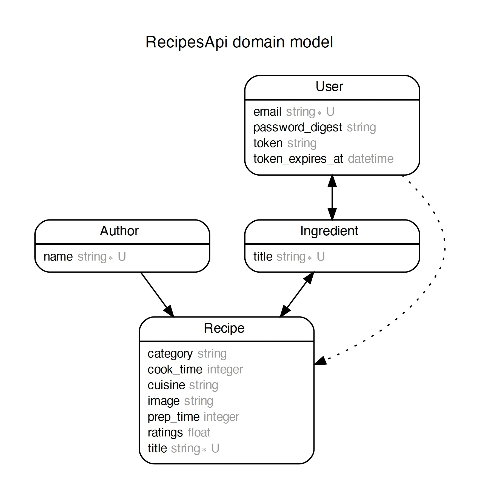

# Recipes API Application

## About

This is a Ruby on Rails API based application, which helps the user see all recipes & recommend recipes bases on ingredients avaiable with the user.

API Application deployed at https://recipes-apis.herokuapp.com/.

React Application deployed at https://recipes-ui.herokuapp.com/.

## System dependencies

1. `Ruby 2.7.2`
2. `Rails 6.0.3`
3. `Postgres`
4. `Docker for Mac`

### Data Modeling

## Development Setup

- Build Docker

`docker-compose build`

- Database creation

`docker-compose run web rake db:setup`

- Start the Application
    `docker-compose up`

## How to run the test suite

`docker-compose run -e RAILS_ENV=test web rspec`

## Patterns of Development

I personally try to keep things simple and small as much as possible. I am a fan of DRY but don't like to go super dry.

Btw I am a good believer in the single responsibility principle & prefer to have a number of classes instead of having a giant single class.

## API Documentation

- http://localhost:3000/api-docs/index.html

## Deployment instructions

- `git push heroku master`
